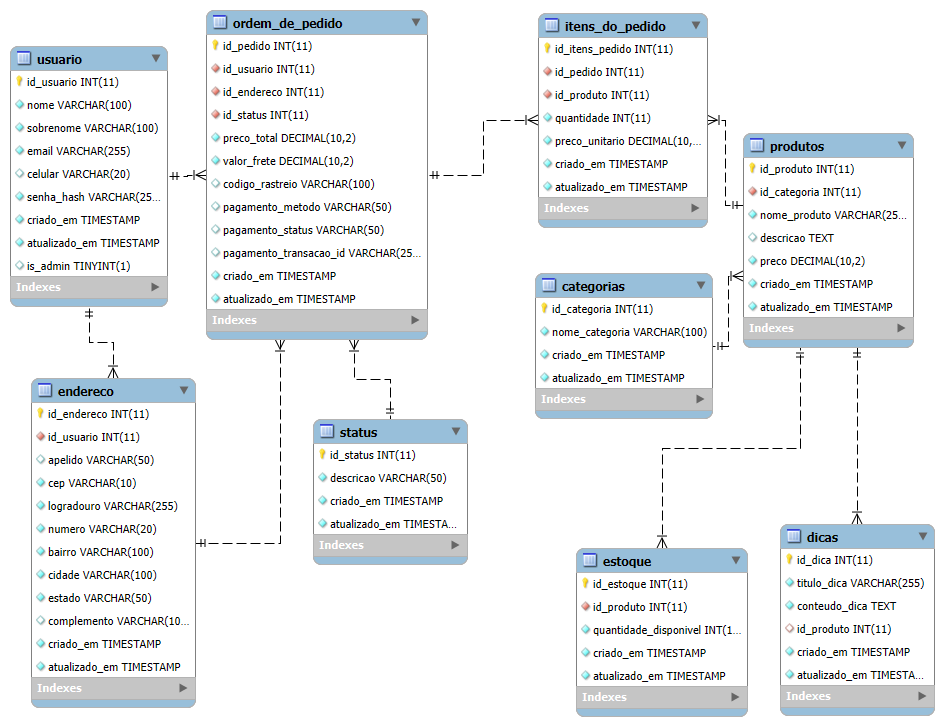

# 🌿 **GardenMe**

## Seu Cantinho Verde Online: Plantas Frescas e Dicas de Cuidado para Florescer\!

Bem-vindo ao repositório do **GardenMe**, o seu projeto integrador do Senac\! Desenvolvemos um e-commerce completo para a venda de plantas, com o diferencial de oferecer **dicas e cuidados especiais** para cada espécie, garantindo que a natureza prospere na casa de nossos clientes em São Paulo.

-----

## ✨ **Funcionalidades Principais**

  * **Catálogo Interativo:** Explore uma vasta coleção de plantas, com fotos, descrições detalhadas e informações de estoque.
  * **Dicas de Cuidado Exclusivas:** Cada planta vem com um guia completo de rega, luz, adubação e muito mais, para que seus clientes se tornem verdadeiros pais de planta\!
  * **Jornada de Compra Intuitiva:** Adicione plantas ao carrinho, personalize seu pedido e finalize a compra com facilidade.
  * **Área do Cliente:** Gerencie seu perfil, acompanhe o status de seus pedidos e acesse seu histórico de compras.
  * **Painel Administrativo:** Gerencie o catálogo de plantas, dicas, usuários e pedidos de forma eficiente.
  * **Autenticação Segura:** Sistema de login e cadastro com JWT para garantir a segurança dos dados.

-----

## 🛠️ **Tecnologias Utilizadas**

Este projeto foi construído utilizando uma stack moderna e robusta, demonstrando as habilidades adquiridas no curso:

  * **Frontend:** **React** com **Vite**
      * Desenvolvimento ágil e performático de interfaces de usuário reativas.
      * Gerenciamento de estado intuitivo e componentes reutilizáveis.
  * **Backend:** **PHP Puro**
      * API RESTful robusta e otimizada para a comunicação com o frontend.
      * Controle total sobre a lógica de negócio e segurança.
  * **Banco de Dados:** **MySQL**
      * Armazenamento eficiente e seguro de todos os dados do e-commerce (plantas, usuários, pedidos, dicas).

-----

## 🚀 Como Rodar o Projeto

Para configurar e rodar o **GardenMe** localmente, siga os passos abaixo:

### **Pré-requisitos**

Certifique-se de ter instalado em sua máquina:

* **PHP** (versão 8.0+)
* **Composer** (gerenciador de dependências PHP)
* **MySQL Server**
* **Node.js** (versão 18+)
* **npm** ou **Yarn**
* Um servidor web como **Apache** ou **Nginx** (XAMPP/WAMP/MAMP são recomendados para Windows/macOS)

### **Passos**

1.  **Clone o Repositório:**

    ```bash
    git clone https://github.com/standbytheboy/gardenme
    cd gardenme
    ```

2.  **Configurar o Backend (PHP):**

    * Navegue até a pasta `backend`: `cd backend`
    * Instale as dependências do PHP: `composer install`, `composer require vlucas/phpdotenv` e `composer require firebase/php-jwt`
    * Cole o seguinte conteúdo no seu arquivo `composer.json`:
      
       ```
        {
          "name": "user/backend",
          "autoload": {
              "psr-4": {
                  "Garden\\": "src/"
              }
          },
          "require": {
              "vlucas/phpdotenv": "^5.6",
              "firebase/php-jwt": "^6.11"
          }
       }

        ```
    * Crie o banco de dados `gardenme` no seu MySQL.
    * Importe os esquemas do banco de dados executando os arquivos SQL na ordem correta: `a00.sql`, `a01.sql`, `a02.sql`.
    * Crie um arquivo `.env` na raiz da pasta `backend` com a seguinte variável de ambiente para a autenticação JWT, e configuração do Banco de Dados:
        ```
        DB_HOST=127.0.0.1
        DB_NAME=gardenme
        DB_USER=root
        DB_PASS=
        JWT_SECRET=sua-chave-secreta-aqui
        ```
    * Certifique-se de que seu servidor web está configurado para apontar para a pasta `backend/public` e que as regras de reescrita de URL (`.htaccess`) estão ativas para o PHP.
    * Inicie o servidor web (por exemplo, Apache). O arquivo `Database.php` aponta para `localhost` na porta `3307`, então ajuste conforme a sua configuração de MySQL.

3.  **Configurar o Frontend (React):**

    * Volte para a pasta raiz do projeto e navegue até a pasta `frontend`: `cd ../frontend`
    * Instale as dependências: `npm install` (ou `yarn install`).
    * Crie um arquivo `.env` na raiz da pasta `frontend` e adicione a URL da sua API backend:
      
        ```
        VITE_API_URL=http://localhost/gardenme/backend/public/api
        ```
    * Inicie o servidor de desenvolvimento do React: `npm run dev` (ou `yarn dev`).

4.  **Acesse o Projeto:**

    * Abra seu navegador e acesse a URL fornecida pelo Vite (geralmente `http://localhost:5173/`).
    * Sua API PHP estará acessível na URL configurada (ex: `http://localhost/gardenme/backend/public/api/categorias`).

-----

## 👥 **Estrutura do Banco de Dados**


----- 
## 👥 **Equipe de Desenvolvimento**

Este projeto foi desenvolvido como parte do Projeto Integrador do Senac por:

  * **Douglas Balbino** - Papel: [Especialista em Backend Core]
  * **Gabriel Aparecido** - Papel: [Especialista em Backend de Lógica de Negócio]
  * **Lucas Morais** - Papel: [Especialista em Frontend]

-----

## 🌟 **Agradecimentos**

Agradecemos ao Senac pela oportunidade e orientação neste projeto desafiador e enriquecedor\!
